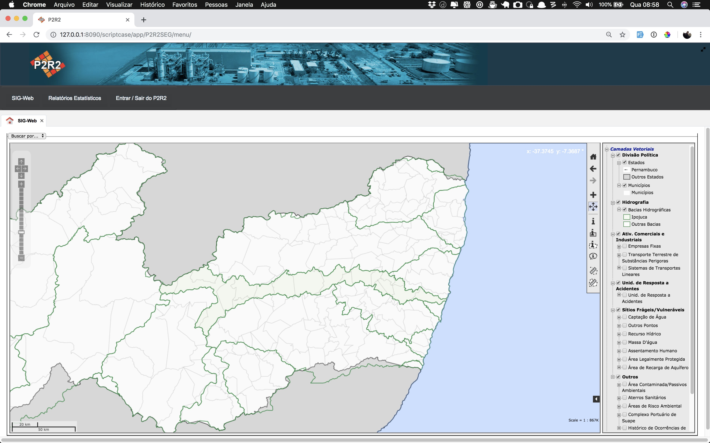
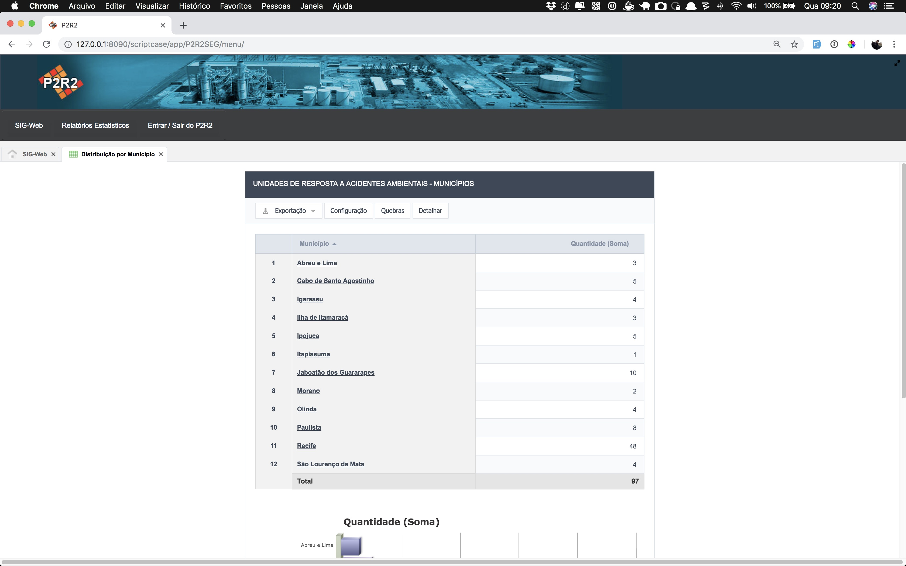
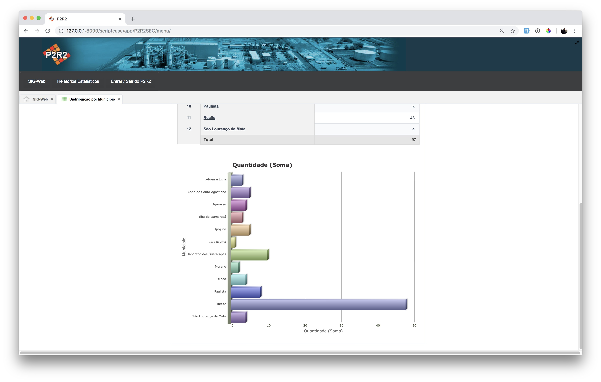

# 1 - Tela Inicial do Sistema P2R2

Ao acessar o endereço eletrônico do P2R2, o usuário poderá visualizar os dados
espaciais através do aplicativo SIG-WEB, e também aos relatórios estatísticos que o sistema disponibiliza (Figura 1).

Figura 1 - Tela Inicial do P2R2.

Também é exibido um link onde é possível que os os usuários cadastrados no sistema
possam ter acesso ao mesmo.

# 1.1 - Relatórios Estatísticos

Os relatórios estatísticos apresentam de forma resumida uma visão geral dos dados contidos no sistema. Compõem esse menu os seguintes itens:

- Áreas Contaminadas / Passivos Ambientais:
	- Distribuição por município;
	- Fonte de Contaminação.

- Atividades Comerciais e Industriais:
	- Produtos Químicos mais Frequentes;
	- Quantidade de Empresas por Município;
	- Quantidade de Produtos Químicos Cadastrados;
	- Quantidade de Resíduos Sólidos Cadastrados;
	- Tipologia de Atividades por Município.

- Histórico de Ocorrência de Acidentes :
	- Distribuição por Município;
	- Produtos Químicos Envolvidos.

- Sistema de Transporte Lineares:
	- Empresas;
	- Produtos Químicos

- Sítios Frágeis e Vulneráveis:
	- Tipologia;
	
- Transporte Terrestre de Substâncias Perigosas:
	- Potencial Poluidor / Degradador;
	- Produtos Químicos;
	- Quantidade de Empresas por Município;
	- Tipologia de Atividade;
	- Quantidade de Produtos Químicos;
	- Quantidade de Resíduos.

- Unidades de Resposta a Acidentes:
	- Distribuição por Município;
	- Tipos de Atendimento Disponíveis.	

A Figura 2 apresenta a visualização da distribuição das unidades de resposta na Área Metropolitana do Recife, onde temos uma tabela com o quantitativo e logo abaixo, um gráfico exbindo os mesmos dados (Figura 3).

Figura 2 - Relatórios Estatísticos: unidades de resposta a acidentes ambientais

Figura 2 - Relatórios Estatísticos: gráfico contendo a distribuição das unidades de resposta na RMR

[Voltar para o índice][1]

[1]:https://github.com/marcellobenigno/p2r2-doc
