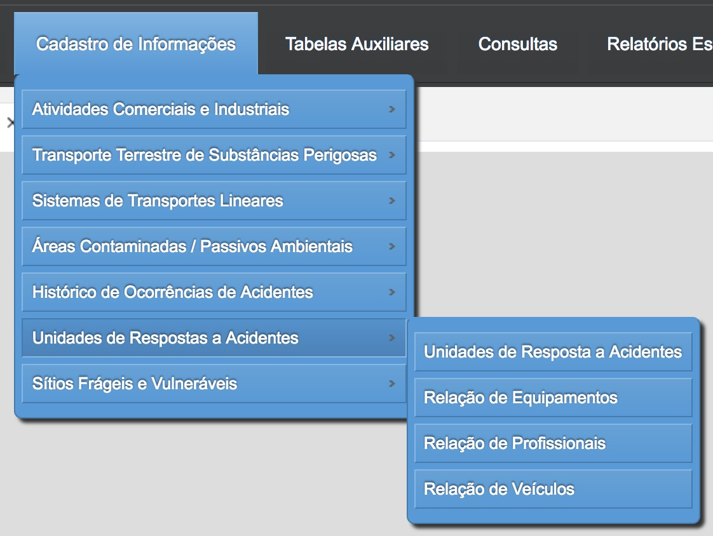
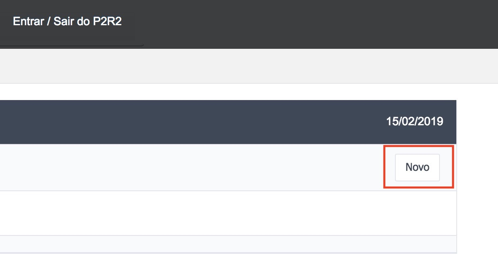
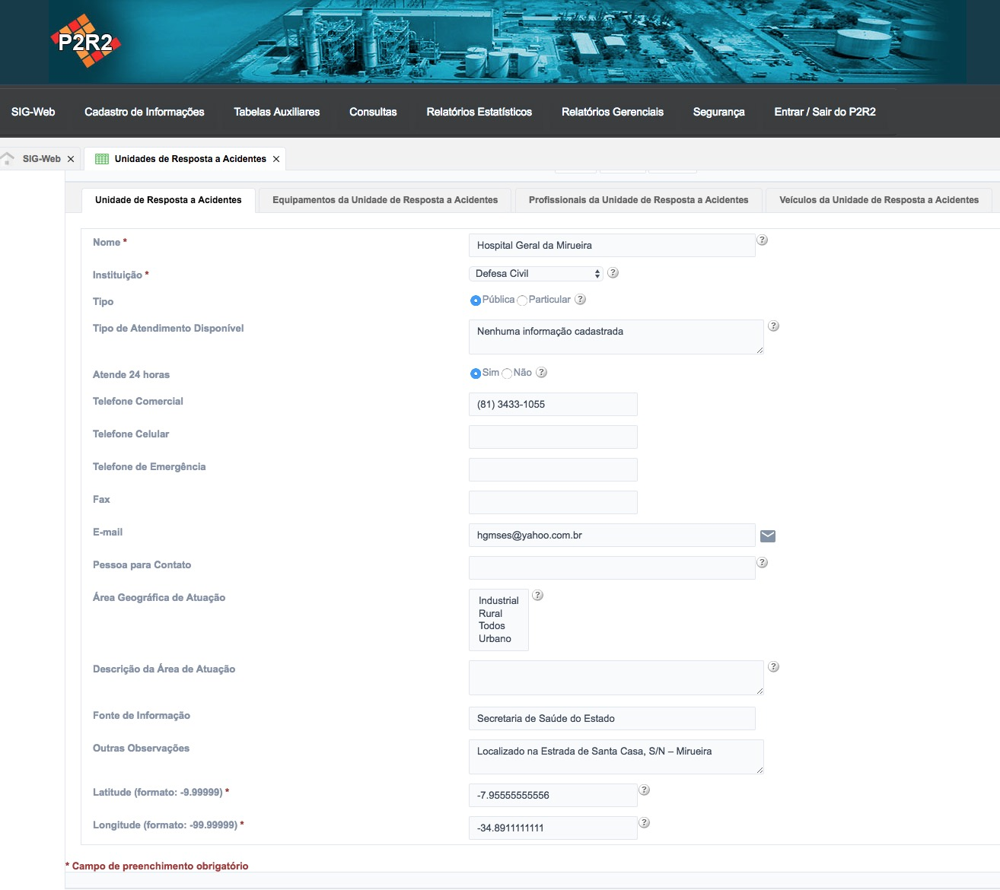
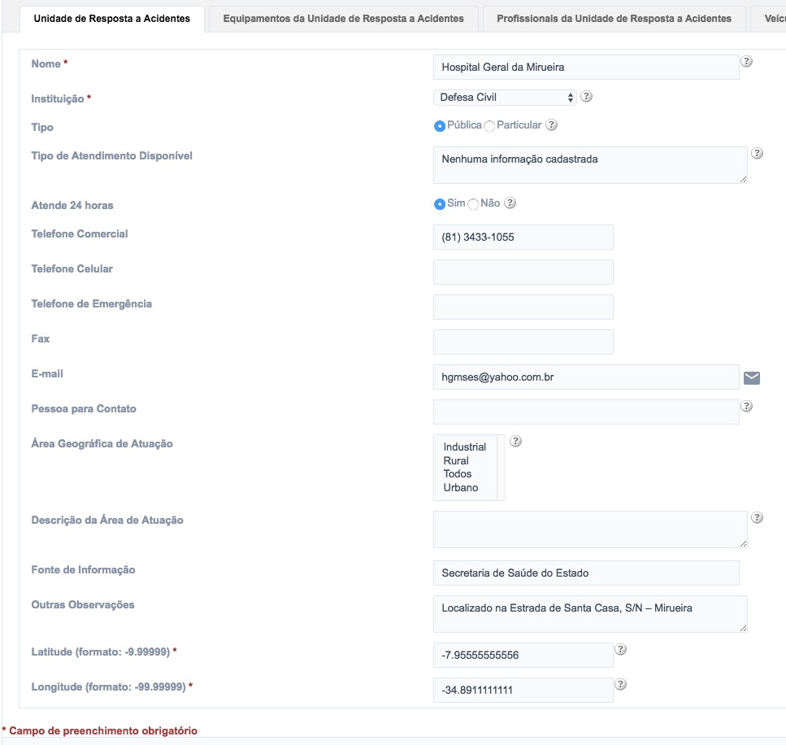
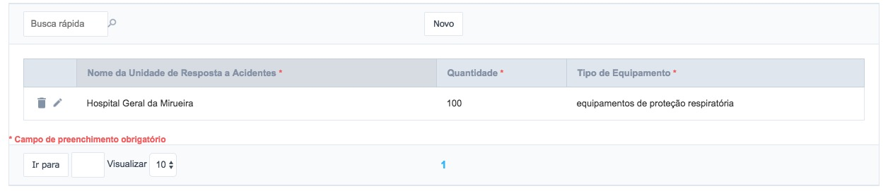
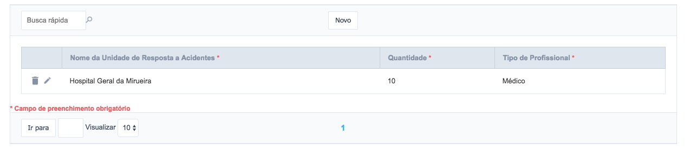
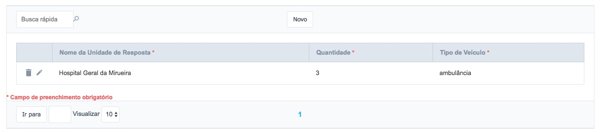

# 10 - Unidades de Respostas a Acidentes

Para interagir com o cadastro do **Unidades de Respostas a Acidentes** o usuário deve acessar o menu **Cadastro de Informações** e em seguida, escolher o segundo item do menu (Figura 63).

## 10.1 - Criando novos registros - Unidades de Respostas a Acidentes

Para cadastrar um novo registro, basta clicar no botão “Novo” conforme a Figura 64:

Figura 64 - Criação de um novo registro

Em seguida, é exibido um formulário para preenchimento do cadastro contendo as abas (Figura 65):

Figura 65 - Criação/Edição de um novo registro

- Unidades de Respostas a Acidentes (Figura 66)
- Equipamentos da Unidade de Resposta a Acidentes (Figura 67)
- Profissionais da Unidade de Resposta a Acidentes  (Figura 68)
- Veículos da Unidade de Resposta a Acidentes (Figura 69)

Figura 66 - Aba de Unidades de Respostas a Acidentes

Figura 67 - Aba de Equipamentos da Unidade de Resposta a Acidentes 

Figura 68 - Aba de Profissionais da Unidade de Resposta a Acidentes

Figura 69 - Aba de Veículos da Unidade de Resposta a Acidentes

[Voltar para o índice][1]

[1]:https://github.com/marcellobenigno/p2r2-doc
