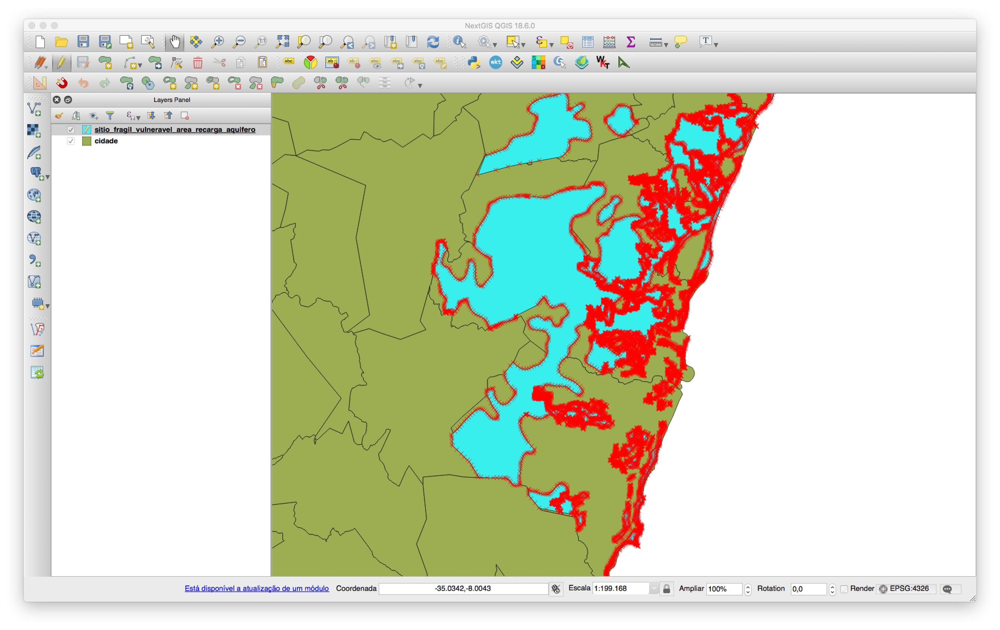
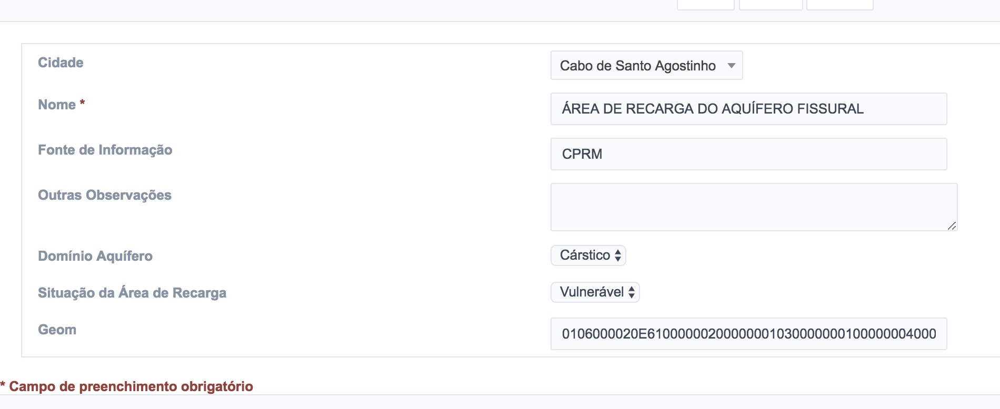
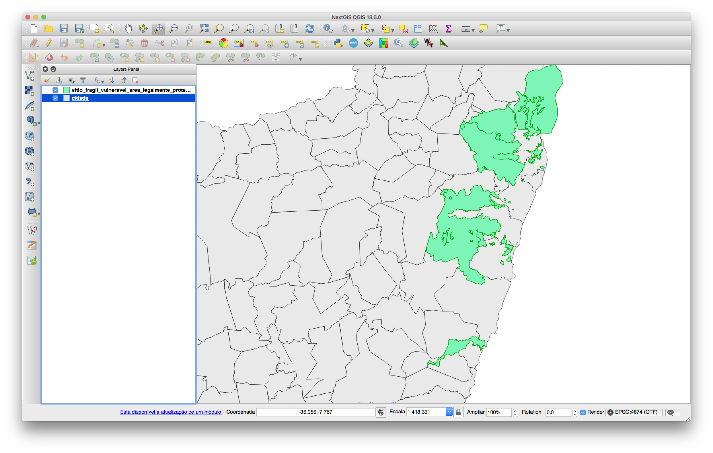
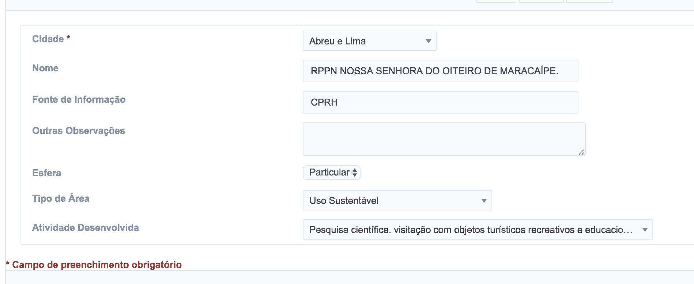
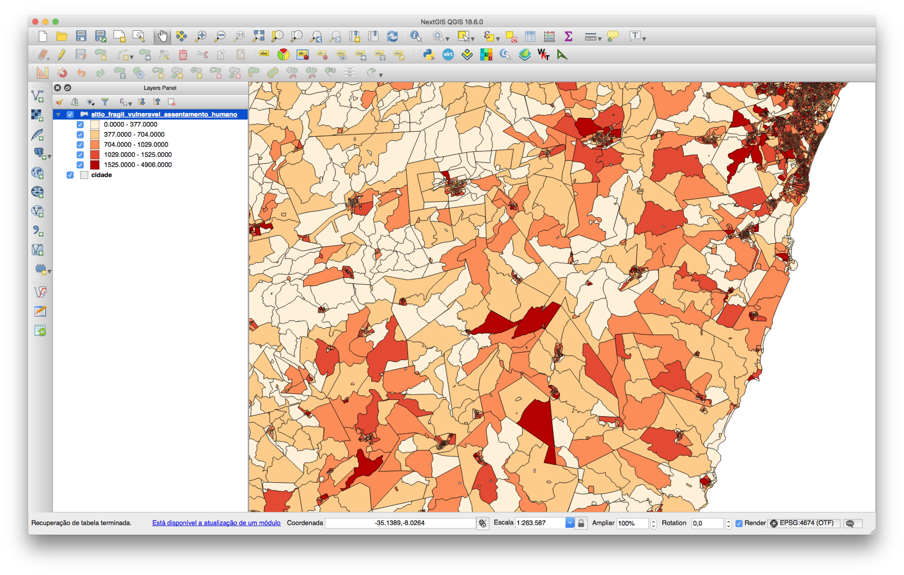
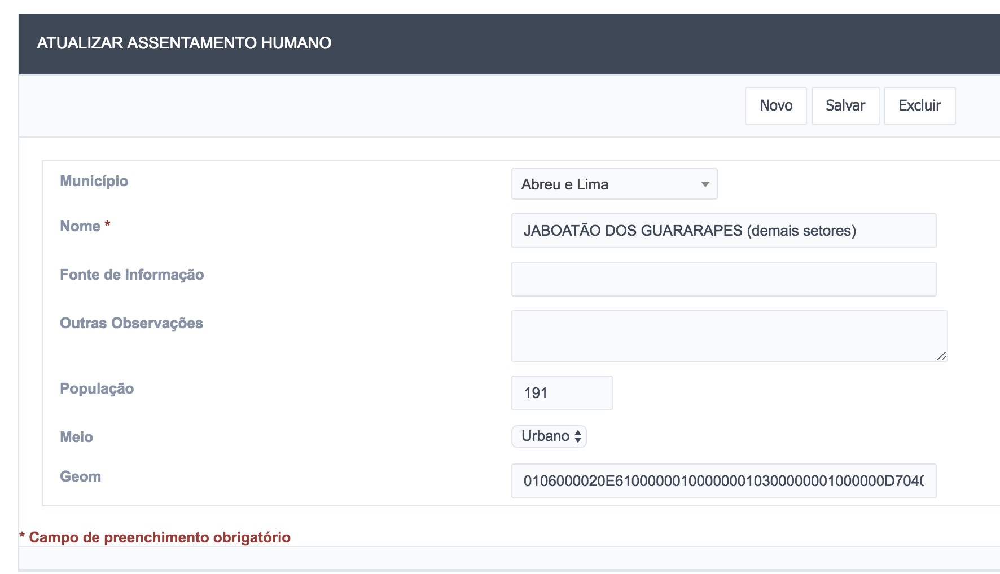
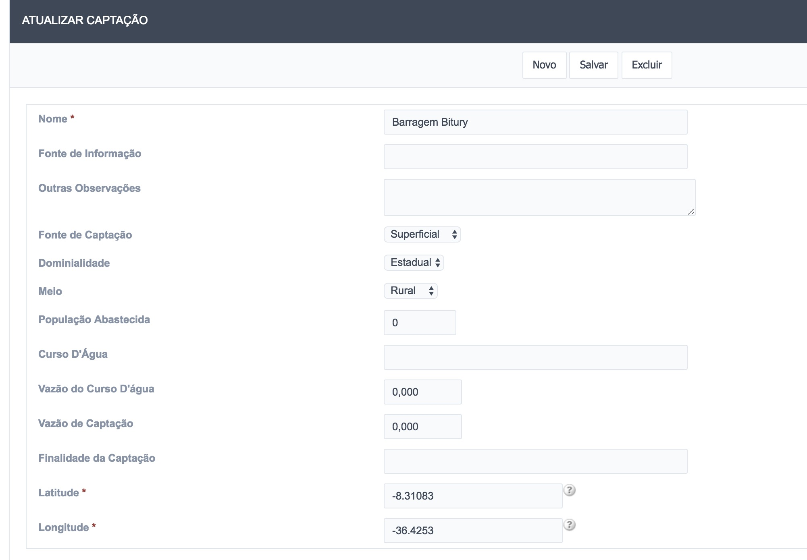
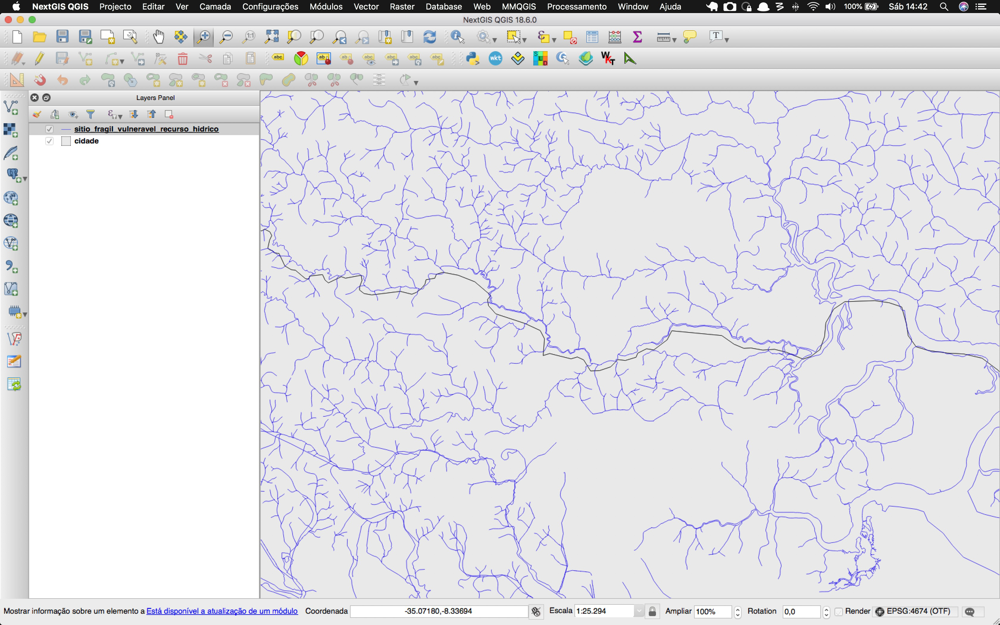
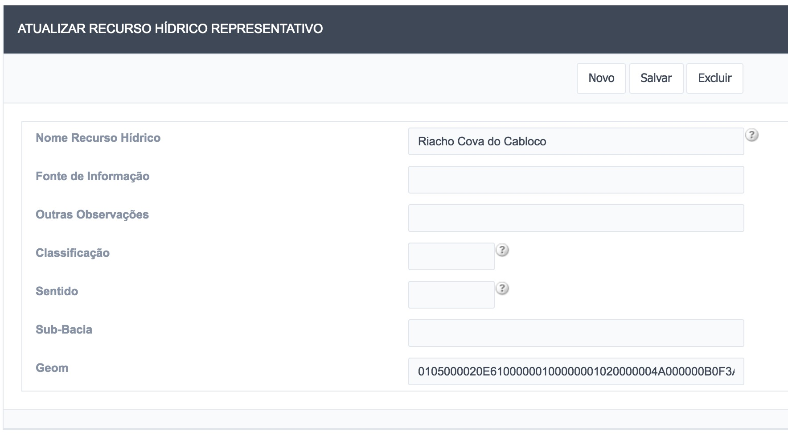
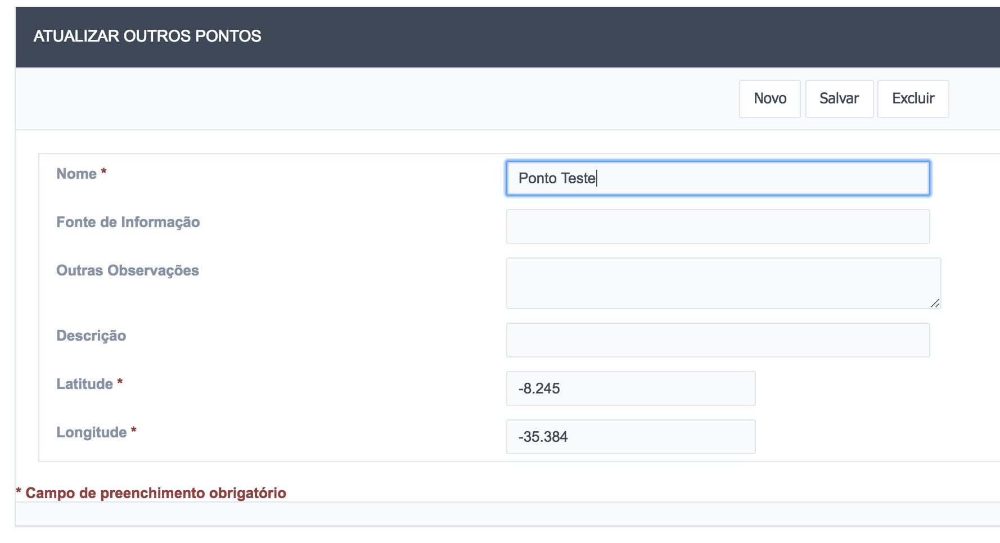

# 11 - Sítios Frágeis e Vulneráveis

Para interagir com o cadastro dos **Sítios Frágeis e Vulneráveis** o usuário deve acessar o menu **Cadastro de Informações** e em seguida, escolher o segundo item do menu (Figura 70).

Figura 70 - Aba dos Sítios Frágeis e Vulneráveis

Os itens que compõem os Sítios Frágeis e Vulneráveis são:

- Áreas de Recarga de Aquíferos
- Áreas Legalmente Protegidas
- Assentamentos Humanos
- Locais de Captação de Água
- Outras Áreas
- Outros Pontos
- Recursos Hídricos Representativos

## 11.1 - Áreas de Recarga de Aquíferos

Por se tratarem de dados espaciais que possuem a geometria do tipo polígono, este item deve ser editado através de um software de SIG, como mostra a Figura 71, onde a tabela `sitio_fragil_vulneravel_area_recarga_aquifero` é editada através do Software NextGIS. Recomenda-se utilizar este software ou o **QGIS**.

Figura 71 - Áreas de Recarga de Aquíferos sendo editadas em um software de SIG

Também é possível editar a tabela de atributos através do sistema P2R2, como mostra a Figura 72.

Figura 72 - Registro da Área de Recarga de Aquífero no P2R2

## 11.2 - Áreas Legalmente Protegidas

Por se tratarem de dados espaciais que possuem a geometria do tipo polígono, este item deve ser editado através de um software de SIG, como mostra a Figura 73, onde a tabela `sitio_fragil_vulneravel_area_legalmente_protegida` é editada através do Software NextGIS. Recomenda-se utilizar este software ou o **QGIS**.

Figura 73 - Áreas Legalmente Protegidas sendo editadas em um software de SIG

Também é possível editar a tabela de atributos através do sistema P2R2, como mostra a Figura 74.

Figura 74 - Registro de uma Área Legalmente Protegida no P2R2 

## 11.3 - Assentamentos Humanos

Por se tratarem de dados espaciais que possuem a geometria do tipo polígono, este item deve ser editado através de um software de SIG, como mostra a Figura 75, onde a tabela `sitio_fragil_vulneravel_assentamento_humano` é editada através do Software NextGIS. Recomenda-se utilizar este software ou o **QGIS**.

Figura 75 - Área Legalmente Protegida sendo editada em um software de SIG

Também é possível editar a tabela de atributos através do sistema P2R2, como mostra a Figura 76.

Figura 76 - Registro de um Assentamento Humano no P2R2

## 11.4 - Locais de Captação de Água

Por se tratarem de dados espaciais que possuem a geometria do tipo ponto, este item pode ser criado/editado diretamente no Sistema P2R2, como mostra a Figura 77.

Figura 75 - Local de Captação de Água sendo editado no P2R2

## 11.5 - Recursos Hídricos Representativos

Por se tratarem de dados espaciais que possuem a geometria do tipo linha, este item deve ser editado através de um software de SIG, como mostra a Figura 73, onde a tabela `sitio_fragil_vulneravel_recurso_hidrico` é editada através do Software NextGIS. Recomenda-se utilizar este software ou o **QGIS**.

Figura 78 - Recursos Hídricos Representativos sendo editados em um software de SIG

Também é possível editar a tabela de atributos através do sistema P2R2, como mostra a Figura 74.

Figura 79 - Registro de um Recurso Hídrico Representativo no P2R2 

## 11.6 - Outros Pontos

De forma semelhante ao item 11.4, este item pode ser editado diretamente no Sistema P2R2.

Figura 80 - Registro da tabela Outros Pontos sendo editado no P2R2 

## 11.7 - Outras Áreas

De forma semelhante ao item 11.1, este item deve ser editado diretamente no QGIS.

[Voltar para o índice][1]

[1]:https://github.com/marcellobenigno/p2r2-doc
