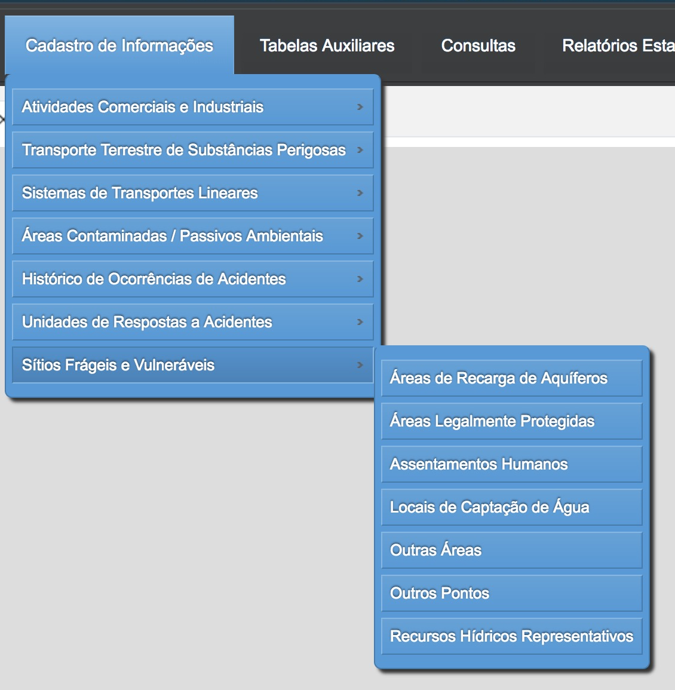

# 11 - Sítios Frágeis e Vulneráveis

Para interagir com o cadastro dos **Sítios Frágeis e Vulneráveis** o usuário deve acessar o menu **Cadastro de Informações** e em seguida, escolher o segundo item do menu (Figura 70).

Figura 70 - Aba dos Sítios Frágeis e Vulneráveis

- Áreas de Recarga de Aquíferos
- Áreas Legalmente Protegidas
- Assentamentos Humanos
- Locais de Captação de Água
- Outras Áreas
- Outros Pontos
- Recursos Hídricos Representativos

## 11.1 - Áreas de Recarga de Aquíferos

[Voltar para o índice][1]

[1]:https://github.com/marcellobenigno/p2r2-doc
