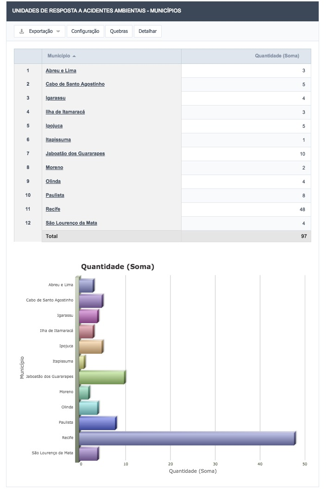

# 13 - Consultas e Relatórios Estatísticos

## 13.1 - Consultas

No menu **Consultas** o usuário poderá selecionar várias opções de consulta, para tanto deverá possuir usuário e senha previamente logados no sistema.

Figura 82 - Menu de Consultas

Os Itens disponíveis para a consulta são os seguintes:

- Áreas Contaminadas / Passivos Ambientais
-  Empresa Fixa
-  Empresa de Transporte
- Sistemas de Transportes Lineares
- Histórico de Ocorrências de Acidentes
- Unidades de Respostas a Acidentes
- Sítios Frágeis e Vulneráveis
	- Áreas Legalmente Protegidas
	- Áreas de Recarga de Aquíferos
	- Assentamentos Humanos
	- Captação de Água
	- Outras Áreas
	- Outros Pontos
	- Recursos Hídricos Representativos

A Figura 83 exemplifica uma das telas de consulta, neste caso, o menu Empresas Fixas, onde é possível obter o detalhamento do mesmo através do clique no ícone da lupa.

Figura 83 - Tela da área de consultas - Empresa Fixa

Figura 84 - Detalhamento de uma Empresa Fixa

## 13.2 - Relatórios Estatísticos

Nesta opção o usuário poderá selecionar diversos relatórios estatísticos, na exibição haverá a opção de navegação e detalhamento dos itens que compõem o relatório, bastando o usuário clicar sobre o dado que deseja detalhar.

Figura 85 - Detalhamento de uma Empresa Fixa

Os relatórios estatísticos disponíveis são os seguintes:

- Áreas Contaminadas / Passivos Ambientais
	- Distribuição por Município
	- Fontes de Contaminação
- Atividades Comerciais e Industriais
	- Produtos Químicos mais Frequentes
	- Quantidade de Empresas por Município
	- Quantidade de Produtos Químicos Cadastrados
	- Quantidade de Resíduos Sólidos Cadastrados
	- Tipologia de Atividades por Município
- Histórico de Ocorrência de Acidentes
	- Distribuição por Município
	- Produtos Químicos Envolvidos
	- Tipologia dos Acidentes
- Potencial Poluidor Degradador
- Sistema de Transporte Lineares
	- Empresas
	- Produtos Químicos
- Transporte Terrestre de Substâncias Perigosas
	- Potencial Poluidor / Degradador
	- Produtos Químicos
- Unidades de Resposta a Acidentes
	- Distribuição por Município
	- Tipos de Atendimento Disponíveis

A Figura 86 apresenta como exemplo de um relatório estatístico, a distribuição das Unidades de Resposta a Acidentes Ambientais da região metropolitana do Recife.

Figura 86 - Exemplo de relatório estatístico

Já a Figua 87 exibe os tipos de atendimento disponíveis destas Unidades de Resposta.

Figura 87 - Tipos de atendimento das unidades de resposta a acidentes

[Voltar para o índice][1]

[1]:https://github.com/marcellobenigno/p2r2-doc
