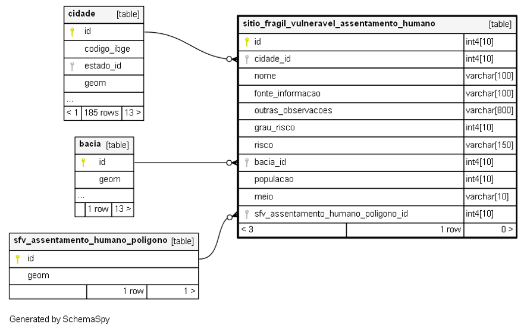

# 14 - Modelo Lógico do Banco de Dados 

A seguir temos a estrutura do Banco de Dados do Sistema P2R2:

## Atividades comerciais e industriais

## Sistemas de transportes lineares

## Transporte terrestre de substâncias perigosas.

## Áreas contaminadas / passivos ambientais 

## Histórico de ocorrência de acidentes

## Unidade de resposta à acidentes.

## Sítios Frágeis / Vulneráveis

### Sítio frágil / vulnerável - área legalmente protegida

### Sítio frágil vulnerável - área recarga aquífero

### Sítio frágil vulnerável - assentamento humano

### Sítio frágil vulnerável – captação

### Sítio frágil vulnerável - recursos hídricos

### Sítio frágil vulnerável - outras áreas

### Sítio frágil vulnerável - outros pontos

[Voltar para o índice][1]

[1]:https://github.com/marcellobenigno/p2r2-doc
