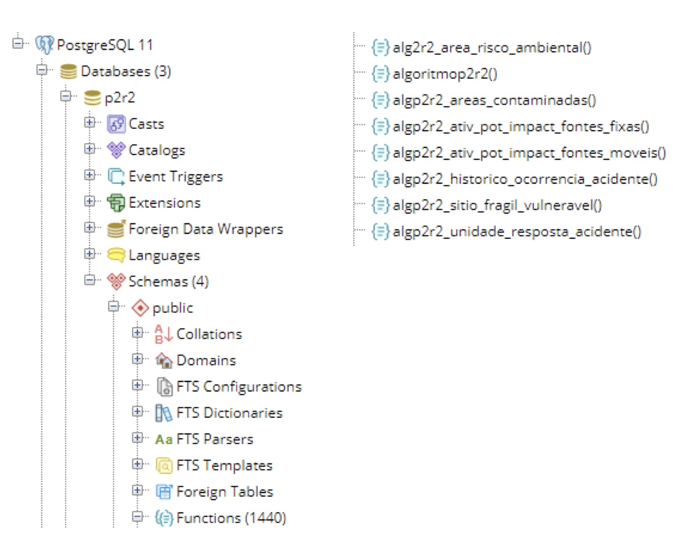
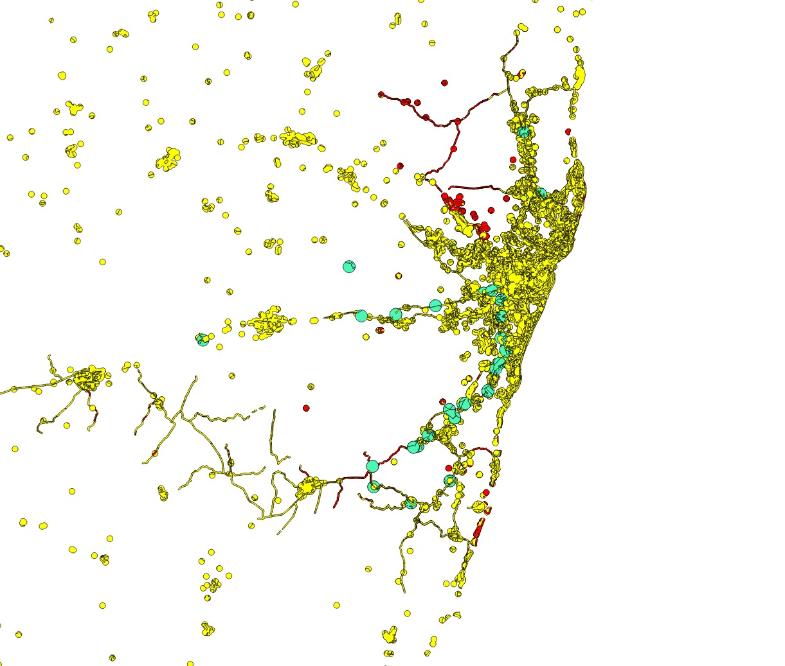

# 15 - ALGORITMO DE GERAÇÃO DE ÁREAS DE RISCO AMBIENTAL

O algoritmo foi adaptado e continua implantado dentro do próprio banco de dados do P2R2 `p2r2`, sob a forma de funções/procedures, escritas em **linguagem SQL (pgpsql)**. O nome as funções foram renomeadas para facilitar a leitura das mesmas.

Para localizar as funções basta acessar o **pgAdmin4**, conectar-se ao servidor PostgreSQL, expandir o banco `p2r2 -> schemas -> public -> functions`, conforme a Figura 88 abaixo:




Figura 88 - Relação das Funções que compõem o algoritmo


Para executá-lo, basta clicar em cima do banco `p2r2`, ir até o menu `Tools`, clicar em `Query Tool` e executar a seguinte instrução: 

```sql
SELECT algoritmop2r2();
```


Executando esta função, todas as outras funções menores (sub-funções) serão executadas internamente.

A seguir uma breve descrição de cada sub-função:

 * **algp2r2_ativ_pot_impact_fontes_fixas()**: determina graus de risco para Atividades Potencialmente Impactantes (fontes fixas);
 * **algp2r2_ativ_pot_impact_fontes_moveis()**: determina graus de risco para Atividades Potencialmente Impactantes (fontes móveis);
 * **algp2r2_areas_contaminadas()**: determina graus de risco para Áreas Contaminadas;
 * **algp2r2_historico_ocorrencia_acidente()**: determina  graus de risco para Histórico de Acidentes Ambientais;
 * **algp2r2_sitio_fragil_vulneravel()**: determina graus de risco para Sítios Frágeis;
 * **algp2r2_unidade_resposta_acidente()**: determina graus de risco para Unidades de Resposta a Acidentes;
 * **alg2r2_area_risco_ambiental()**: determina áreas de risco ambiental com base nos graus de risco e cruzamentos espaciais.

 
Caso se opte por executar cada uma das funções independentes, é importante mencionar que elas podem ser executadas em qualquer ordem, com exceção da função `alg2r2_area_risco_ambiental()`, que sempre deve ser executada por último.
Para rodar cada função, o procedimento é o mesmo: 

```sql
SELECT <nome da função>;
```

## 15.1 - Visualização dos Resultados

A Figura 89 apresenta o resultado do algoritmo após a importação dos dados do SILIA para o P2R2.



Figura 89 - Resultado da determinação das áreas de risco 
