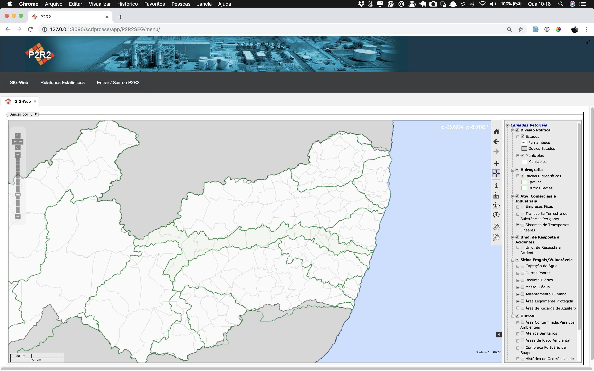
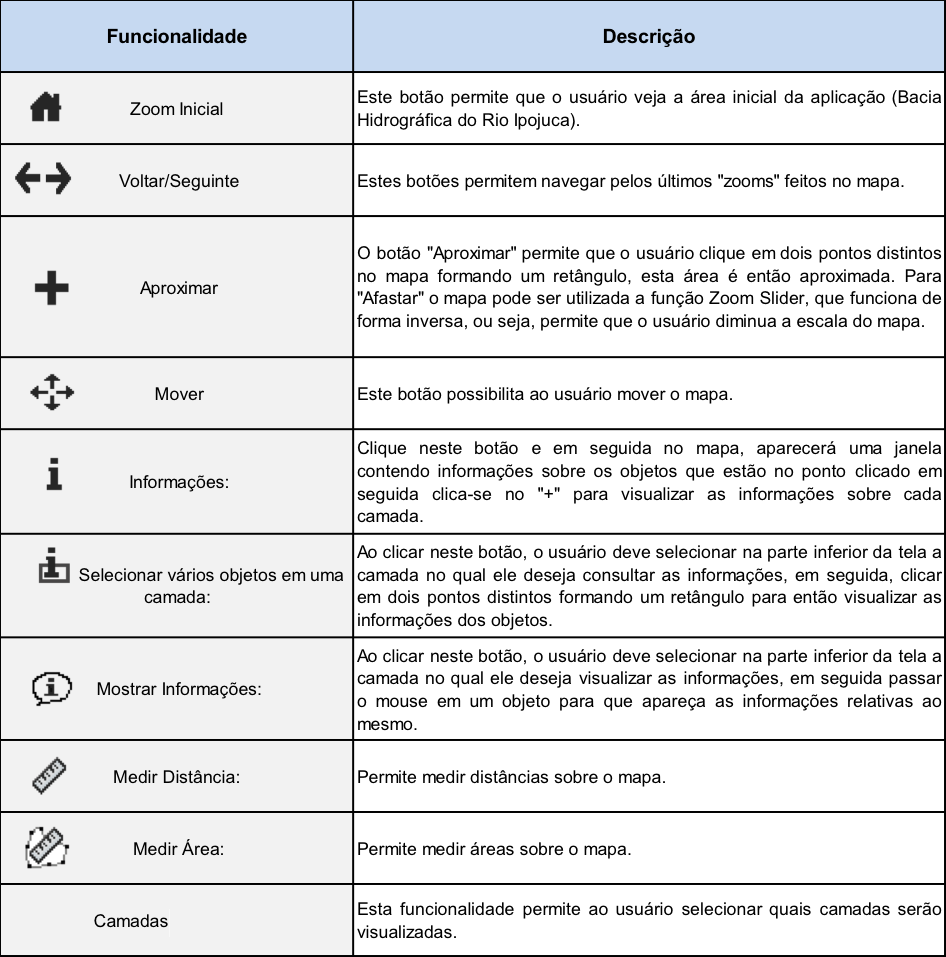
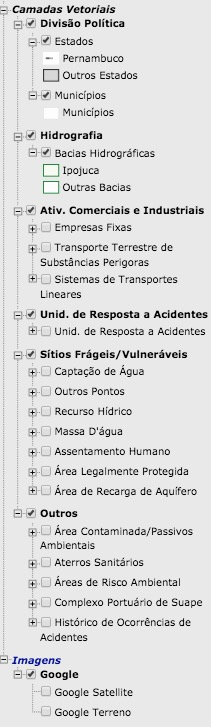

# 2 - O SIG-WEB

A interface SIG-WEB possibilita a visualização e interação com as tabelas espaciais armazenadas no Sistema Gerenciador de Bando de Dados - SGBD. Nela é possível realizar consultas, fazer medições de distância e área (de forma aproximada), ligar e desligar camadas e sobrepor os temas sobre a API (*Application Programming Interface*) do Google Maps (Figura 4).

Figura 4 - Interface do SIG-WEB

No lado direito da interface do SIG-WEB concentram-se os botões que permitem a interação do usuário com esta aplicação, suas funcionalidades estão descritas na Figura 5.

Figura 5 - Funcionalidades do SIG-WEB

Na Figura 6 são exibidas as camadas que fazem parte da interface do SIG-WEB. O usuário pode interagir ligando e desligando as camadas de acordo com a sua necessidade.

Figura 6 - Camadas ou *layers* do SIG-WEB

[Voltar para o índice][1]

[1]:https://github.com/marcellobenigno/p2r2-doc
