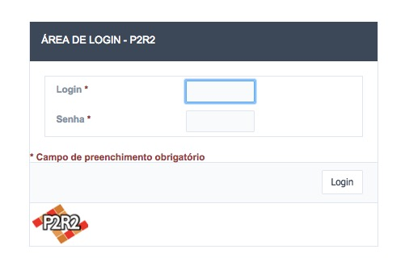

# 3 - Área de Login

Nesta área do P2R2 temos três diferentes tipos de usuários (Figura 7):

Figura 7 - Área de login do sistema

- Usuários Administrativos: uma vez autenticados, estes usuários podem criar/editar/deletar qualquer registro do sistema;
- Empresas: podem apenas editar o seu respectivo cadastro, não sendo possível alterar os dados que não sejam relacionadas a mesma;
- Unidades de Resposta a Acidentes: de forma semelhante as empresas, as unidades de resposta não podem editar nenhum dado que não esteja relacionado ao seu cadastro.

[Voltar para o índice][1]

[1]:https://github.com/marcellobenigno/p2r2-doc
