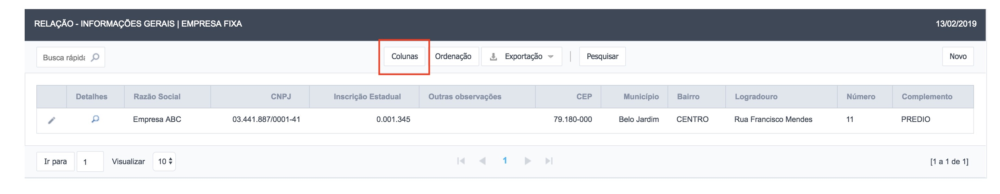
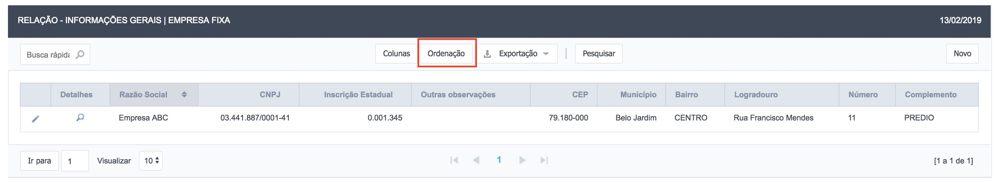
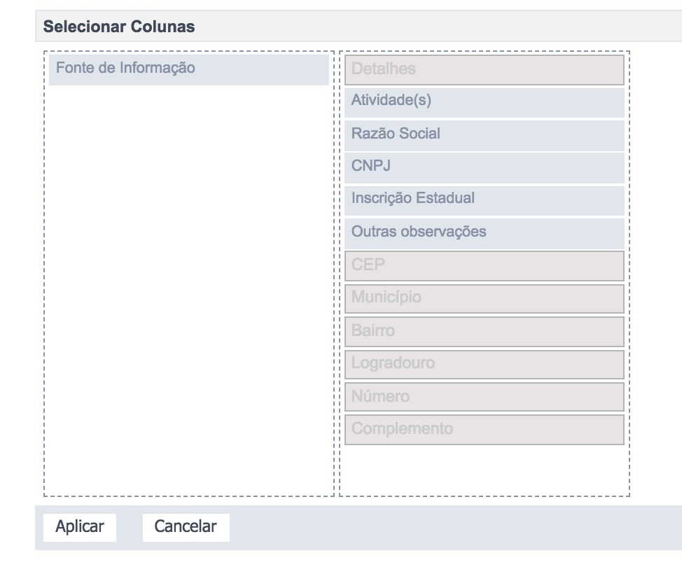
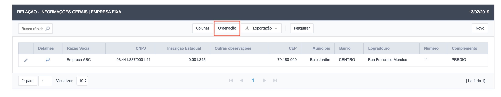
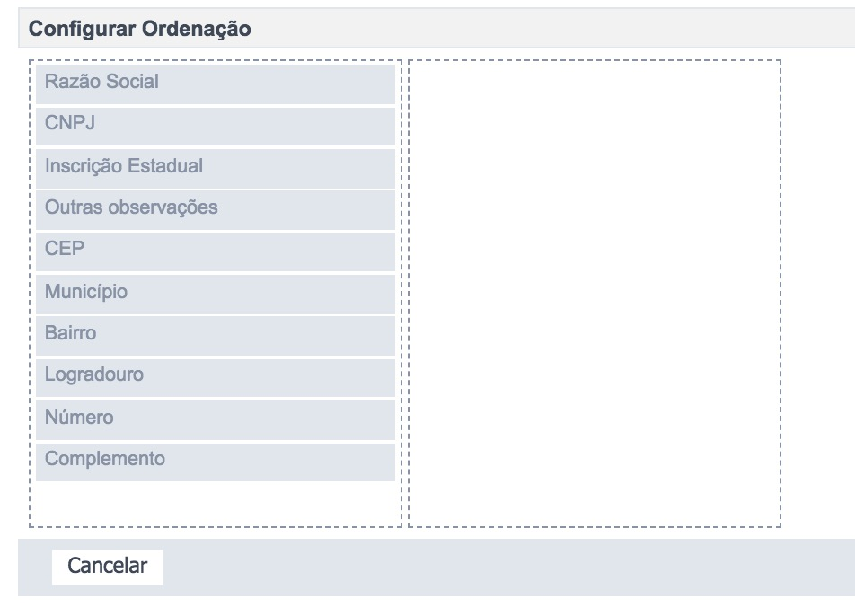
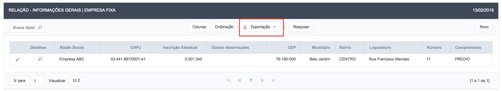
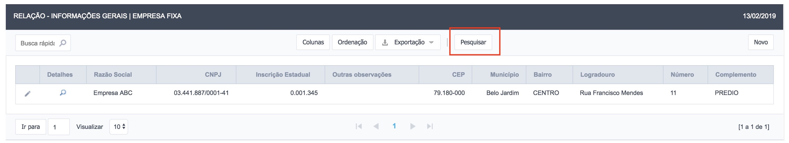
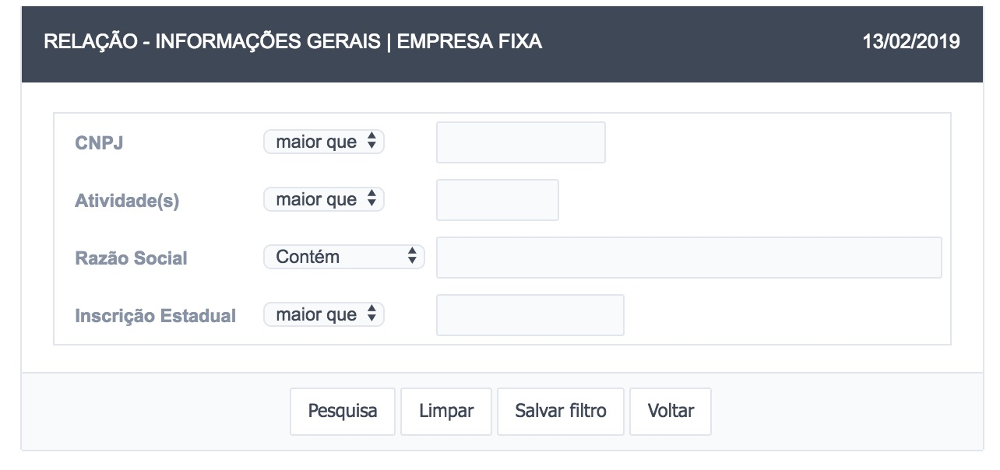

# 4 - Funcionalidades Gerais

Nesta seção serão apresentadas as funcionalidades gerias, presentes em quase todas as telas do Sistema P2R2, são elas:

- Busca rápida (Figura 8):

Figura 8: busca rápida

A ferramenta de busca rápida serve para filtrar por qualquer informação existente em todas as colunas da relação de dados da tela que está ativa.

- Colunas (Figura 9): 

Figura 9: botão da ferramenta colunas

Ao clicar neste botão, será aberta uma janela conforme a Figura 10. Para exibir uma determinada coluna, basta arrastar a coluna do lado esquerdo para o lado direito. Para ocultar, basta arrastá-la do lado direito para o lado esquerdo.

Figura 10: ferramenta colunas aberta

- Ordenação (Figura 11):

Figura 11: Botão da Ferramenta de Ordenação

Ao clicar neste botão, será aberta uma janela conforme a Figura 12:

Figura 12 - Ferramenta de Ordenação aberta

Para ordenar, basta arrastar as colunas da esquerda para direita e informar se a ordenação será ascendente ou descendente, em seguida arrastar de baixo para cima ou de cima para baixo para informar a prioridade da ordenação.

- Exportação (Figura 13):

Figura 13 - Ferramenta de Exportação

Permite ao usuário exportar os dados da tabela em diversos formatos, tais como: pdf, word, excel, cvs, dentre outros.

- Pesquisar (Figura 14):

Figura 14 - Ferramenta de Pesquisa

Ao clicar no botão pesquisar, a janela exibida na Figura 15 fica disponível para que o usuário realize um filtro ou seleção multicritério, possibilitando dessa forma, realizar uma pesquisa mais complexa nos dados que estão sendo exibidos na tela.

Figura 15 - Filtro Multicritério

[Voltar para o índice][1]

[1]:https://github.com/marcellobenigno/p2r2-doc
