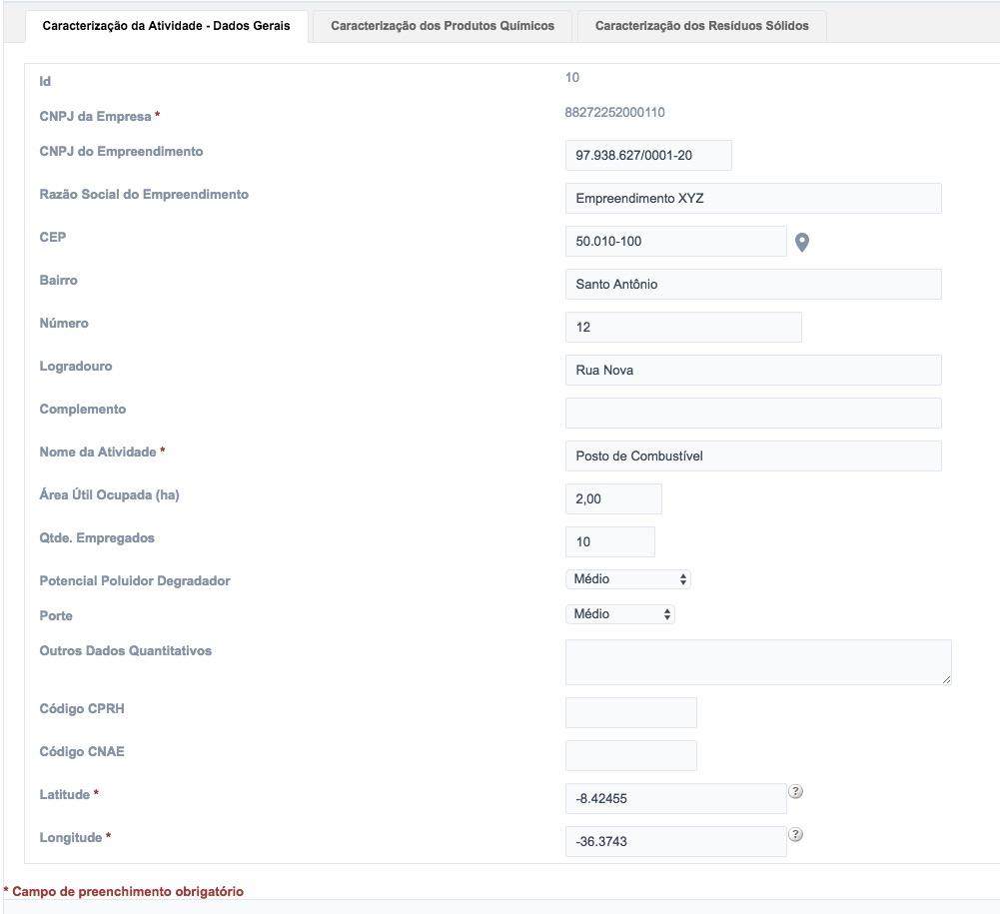
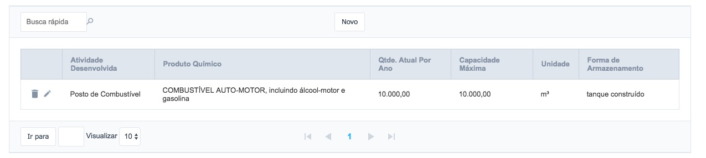
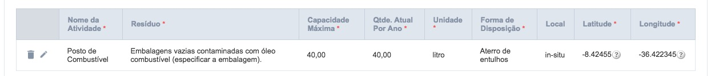

# 5 - Atividades Comerciais e Industriais

Para interagir com o cadastro das **Atividades Comerciais e Industriais** o usuário deve acessar o menu **Cadastro de Informações** e em seguida, escolher o primeiro item do menu (Figua 16).

Figura 16 - Acesso aos Itens das Atividades Comerciais e Industriais

Para facilitar a navegabilidade do usuário, foram criados 6 submenus, que serão apresentados a seguir:

## 5.1 - Criando novos registros - Empresa Fixa

Para cadastrar um novo registro, basta clicar no botão “Novo” conforme a Figura 17:

Figura 17 - Criação de um novo registro

E seguida, é exibido um formulário para preenchimento do cadastro contendo as abas (Figura 18):

- Dados Gerais (Figura 19);
- Estruturas de Contenção e Instrumentos de Gestão (Figura 20), e
- Automonitoramento (Figura 21).

Figura 18 - Criação de um novo registro (valores meramente ilustrativos)

É importante ressaltar que as abas **Estruturas de Contenção e Instrumentos de Gestão** e **Automonitoramento** só estarão disponíveis após o usuário salvar os dados da aba **Dados Gerais**

Figura 19 - Aba Dados Gerais Preenchida

Figura 20 - Aba Estruturas de Contenção e Instrumentos de Gestão Preenchida (valores meramente ilustrativos)

Figura 21 - Aba Automonitoramento Preenchida (valores meramente ilustrativos)

Uma vez preenchidos os formulários, o usuário pode facilmente editar qualquer um deles através do clique no ícone semelhante a um lápis que fica no início da linha que representa aquele conjunto de dados.

## 5.2 - Criando novos registros - Caracterização da Atividade

Uma vez definidos os dados do item 5.1, o usuário poderá inserir os dados da **Caracterização da Atividade** (Figura 22), clicando neste item do menu, em seguida deve-se clicar no botão **Novo**.

Assim como o primeiro formulário, este também possui três abas, específicas para cada conjunto de dados, são eles:

- Dados Gerais (Figura 22)
- Caracterização dos Produtos Químicos (Figura 23)
- Caracterização dos Resíduos Sólidos (Figura 24)

Figura 22 - Aba da Caracterização da Atividade Preenchida (valores meramente ilustrativos)

Figura 23 - Aba da Caracterização dos Produtos Químicos Preenchida (valores meramente ilustrativos)

Figura 24 - Aba da Caracterização dos Produtos Químicos Preenchida (valores meramente ilustrativos)

[Voltar para o índice][1]

[1]:https://github.com/marcellobenigno/p2r2-doc
