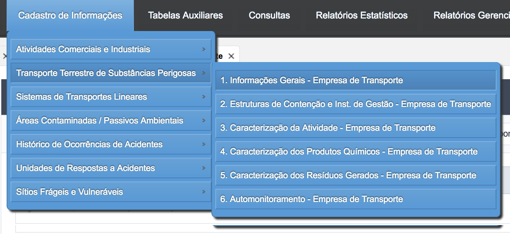
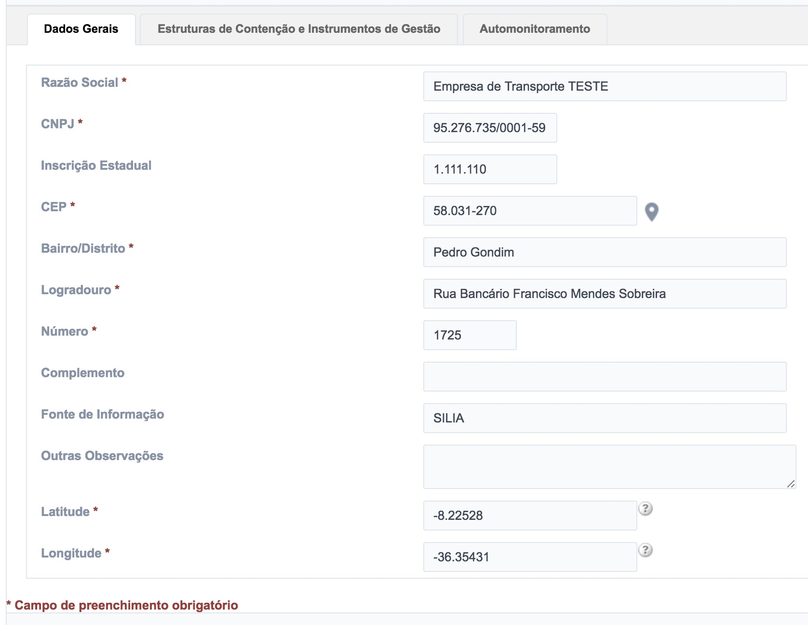
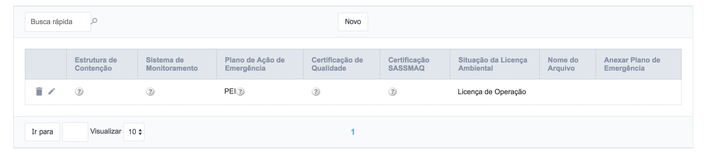
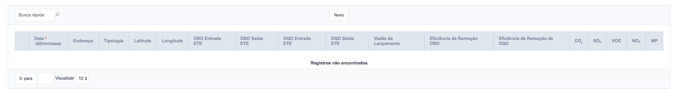
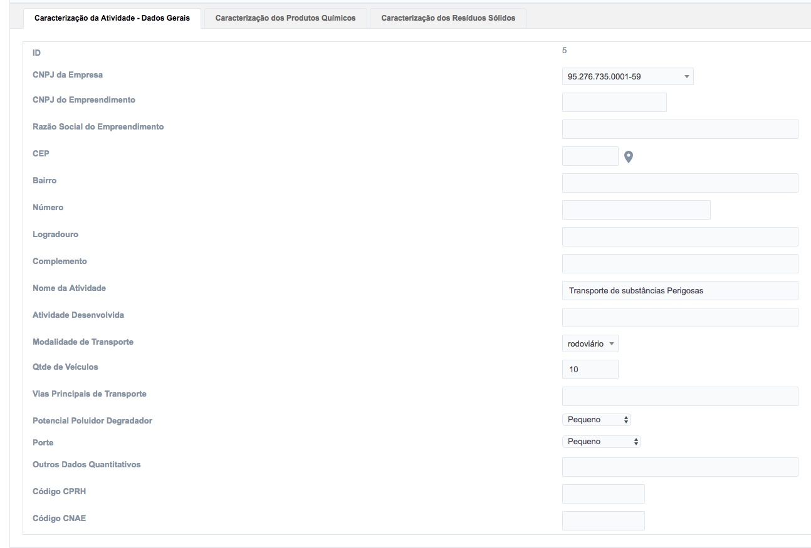
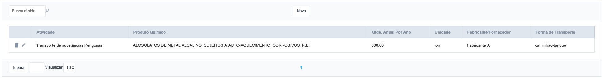
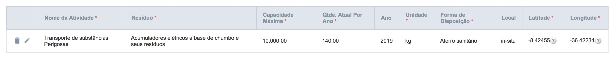

# 6 - Transporte Terrestre de Substâncias Perigosas

Para interagir com o cadastro das **Transporte Terrestre de Substâncias Perigosas** o usuário deve acessar o menu **Cadastro de Informações** e em seguida, escolher o segundo item do menu (Figura 25).

Figura 25 - Acesso aos Itens Relacionados ao Transporte Terrestre de Substâncias Perigosas

De forma semelhante ao item 5, para facilitar a navegabilidade do usuário, foram criados 6 submenus, que permitem que o usuário visualize, adicione, atualize e remova os registros.

## 6.1 - Criando novos registros - Empresa de Transporte

Para cadastrar um novo registro, basta clicar no botão “Novo” conforme a Figura 26:

Figura 26 - Criação de um novo registro

Em seguida, é exibido um formulário para preenchimento do cadastro contendo as abas (Figura 27):

- Dados Gerais (Figura 27);
- Estruturas de Contenção e Instrumentos de Gestão (Figura 28), e
- Automonitoramento (Figura 29).

Figura 27 - Aba Dados Gerais Preenchida

É importante ressaltar que as abas **Estruturas de Contenção e Instrumentos de Gestão** e **Automonitoramento** só estarão disponíveis após o usuário salvar os dados da aba **Dados Gerais**

Figura 28 - Aba Estruturas de Contenção e Instrumentos de Gestão Preenchida

Figura 29 - Aba Automonitoramento

## 6.2 - Criando novos registros - Caracterização da Atividade

Uma vez definidos os dados do item 6.1, o usuário poderá inserir os dados da **Caracterização da Atividade** (Figura 30), clicando neste item do menu, em seguida deve-se clicar no botão **Novo**.

Assim como o primeiro formulário, este também possui três abas, específicas para cada conjunto de dados, são eles:

- Dados Gerais (Figura 31)
- Caracterização dos Produtos Químicos (Figura 32)
- Caracterização dos Resíduos (Figura 33)

Figura 31 - Aba da Caracterização da Atividade Preenchida

Figura 32 - Aba da Caracterização dos Produtos Químicos Preenchida

Figura 33 - Aba da Caracterização dos Resíduos Preenchida

[Voltar para o índice][1]

[1]:https://github.com/marcellobenigno/p2r2-doc
