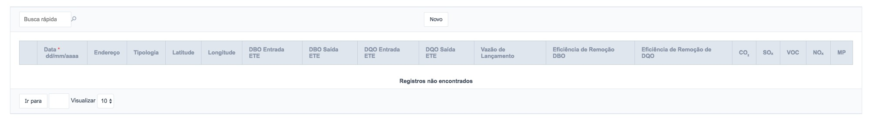
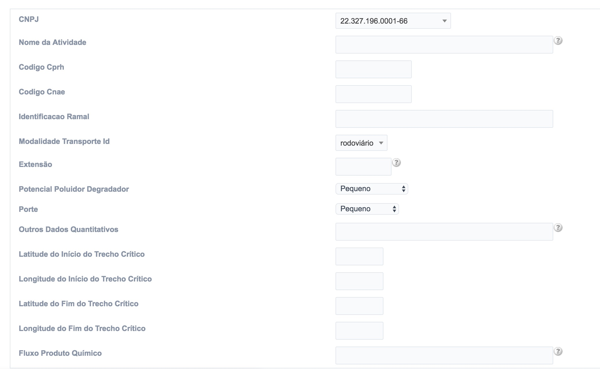
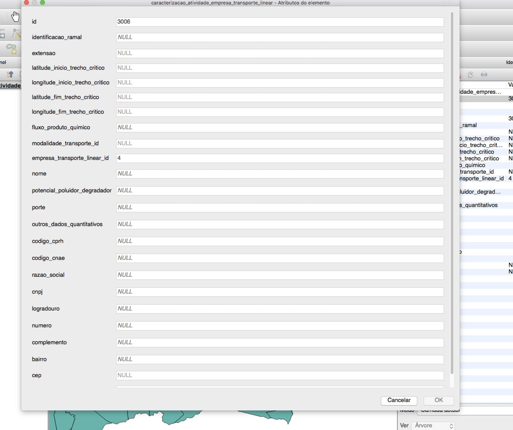
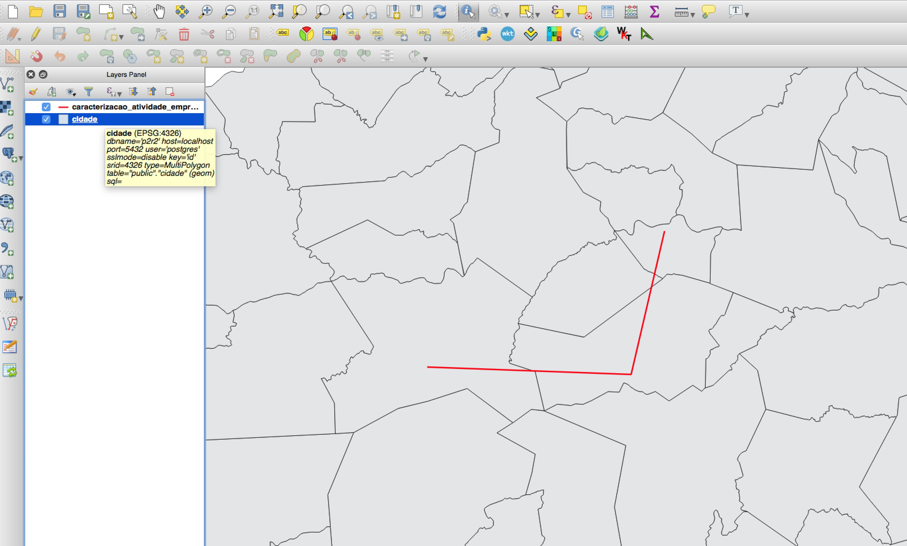
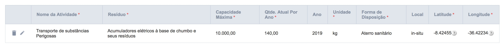

# 7 - Sistemas de Transportes Lineares

Para interagir com o cadastro das **Sistemas de Transportes Lineares** o usuário deve acessar o menu **Cadastro de Informações** e em seguida, escolher o segundo item do menu (Figura 34).

Figura 37 - Acesso aos Itens Relacionados ao Sistemas de Transportes Lineares

De forma semelhante ao item 6 desta documentação, para facilitar a navegabilidade do usuário, foram criados 6 submenus, que permitem que o usuário visualize, adicione, atualize e remova os registros.

## 7.1 - Criando novos registros - Sistemas de Transportes Lineares

Para cadastrar um novo registro, basta clicar no botão “Novo” conforme a Figura 38:

Figura 38 - Criação de um novo registro

Em seguida, é exibido um formulário para preenchimento do cadastro contendo as abas (Figura 39):

- Dados Gerais (Figura 39);
- Estruturas de Contenção e Instrumentos de Gestão (Figura 40), e
- Automonitoramento (Figura 41).

Figura 39 - Aba Dados Gerais Preenchida

É importante ressaltar que as abas **Estruturas de Contenção e Instrumentos de Gestão** e **Automonitoramento** só estarão disponíveis após o usuário salvar os dados da aba **Dados Gerais**

Figura 40 - Aba Estruturas de Contenção e Instrumentos de Gestão Preenchida

Figura 41 - Aba Automonitoramento

## 7.2 - Criando novos registros - Caracterização da Atividade

Uma vez definidos os dados do item 7.1, o usuário poderá inserir os dados da **Caracterização da Atividade**, clicando neste item do menu, em seguida deve-se clicar no botão **Novo**.

Assim como o primeiro formulário, este também possui três abas, específicas para cada conjunto de dados, são eles:

- Dados Gerais (Figura 42)
- Caracterização dos Produtos Químicos (Figura 43)
- Caracterização dos Resíduos (Figura 44)

Figura 43 - Aba da Caracterização da Atividade

Pela natureza espacial dessa tabela, **recomenda-se** que a mesma seja preenchida utilizando o software QGIS, pois nele é possível traçar com precisão os ramais (linhas) que compõem o sistema de transporte linear. Neste caso o usuário tem que estar atento para informar o valor de chave correta `empresa_transporte_linear_id` para que o ramal seja ligado a tabela empresa (Figuras 44 e 45).

Figura 44 - Inserção do ramal pelo Software QGIS

Figura 45 - Visualização do ramal no Software QGIS

Uma vez preenchida a aba dados gerais da caracterização da atividade, o procedimento para inserir os dados nas outras duas abas é a mesma dos itens anteriores, como podemos ver nas figuras 46 e 47.

Figura 46 - Aba da Caracterização dos Produtos Químicos Preenchida

Figura 47 - Aba da Caracterização dos Resíduos Preenchida

[Voltar para o índice][1]

[1]:https://github.com/marcellobenigno/p2r2-doc
