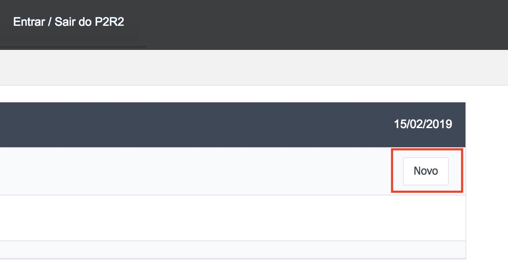

# 8 - Áreas Contaminadas / Passivos Ambientais

Para interagir com o cadastro das **Áreas Contaminadas / Passivos Ambientais** o usuário deve acessar o menu **Cadastro de Informações** e em seguida, escolher o segundo item do menu (Figura 48).

Figura 48 - Acesso aos Itens Relacionados as Áreas Contaminadas / Passivos Ambientais

Para facilitar a navegabilidade do usuário, foram criados 5 submenus, que permitem que o usuário visualize, adicione, atualize e remova os registros.

## 8.1 - Criando novos registros - Áreas Contaminadas / Passivos Ambientais

Para cadastrar um novo registro, basta clicar no botão “Novo” conforme a Figura 49:

Figura 49 - Criação de um novo registro

Em seguida, é exibido um formulário para preenchimento do cadastro contendo as abas (Figura 50):

- Dados Gerais (Figura 51)
- Empresa Responsável pela Área/Atividade (Figura 52)
- Estruturas de Contenção e Instrumentos de Gestão (Figura 53)
- Meio Impactado (Figura 54)
- Caracterização dos Produtos Químicos (Figura 55)
- Caracterização dos Resíduos Sólidos (Figura 56)

Figura 50 - Cadastro de uma Áreas Contaminada / Passivo Ambiental

Figura 51 - Aba Dados Gerais Preenchida

Figura 52 - Aba Empresa Responsável pela Área/Ativida Preenchida

Figura 53 - Aba Estruturas de Contenção e Instrumentos de Gestão Preenchida

Figura 54 - Aba Meio Impactado Preenchida

Figura 54 - Aba Caracterização dos Produtos Químicos Preenchida

Figura 56 - Aba Caracterização dos Resíduos Sólidos Preenchida

[Voltar para o índice][1]

[1]:https://github.com/marcellobenigno/p2r2-doc
