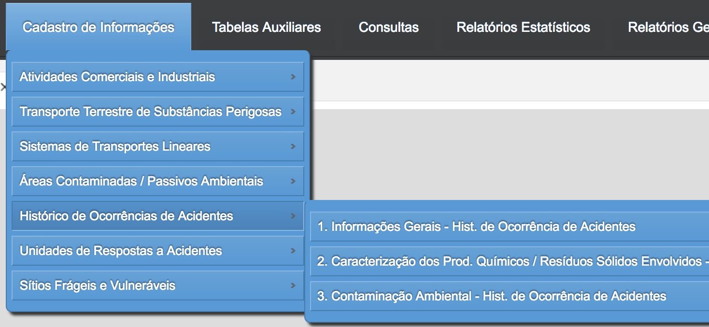
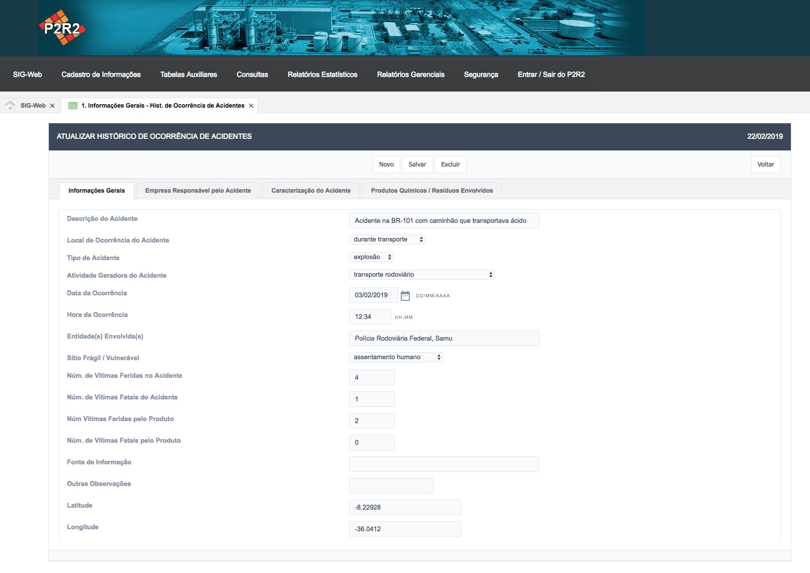
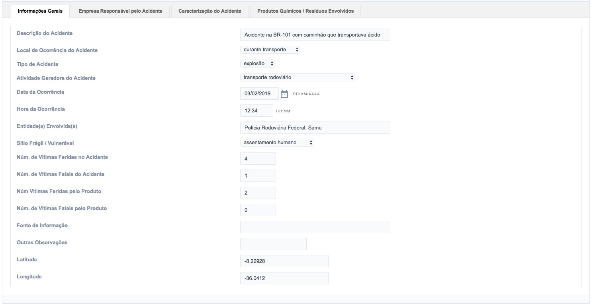
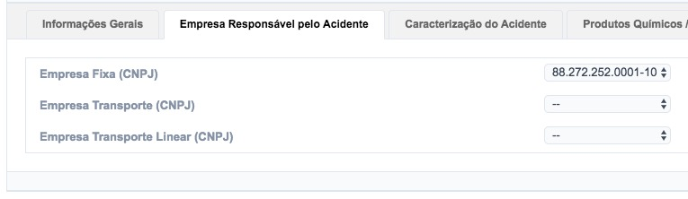
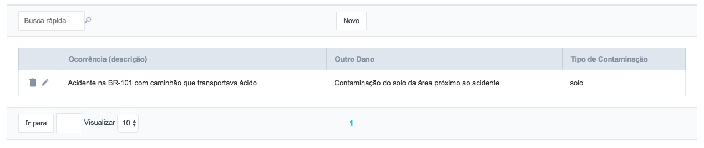
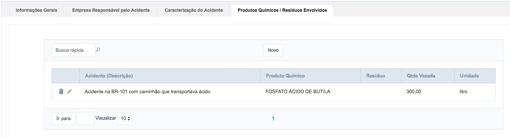

# 9 - Histórico de Ocorrências de Acidentes

Para interagir com o cadastro do **Histórico de Ocorrências de Acidentes** o usuário deve acessar o menu **Cadastro de Informações** e em seguida, escolher o segundo item do menu (Figura 57).

Figura 57 - Acesso aos Itens Relacionados ao Histórico de Ocorrências de Acidentes

Para facilitar a navegabilidade do usuário, foram criados 3 submenus, que permitem que o usuário visualize, adicione, atualize e remova os registros.

## 9.1 - Criando novos registros - Histórico de Ocorrências de Acidentes

Para cadastrar um novo registro, basta clicar no botão “Novo” conforme a Figura 58:

Figura 58 - Criação de um novo registro

Em seguida, é exibido um formulário para preenchimento do cadastro contendo as abas (Figura 59):

Figura 58 - Criação/Edição de um novo registro

- Informações Gerais (Figura 60)
- Empresa Responsável pelo Acidente (Figura 61)
- Caracterização do Acidente (Figura 62)
- Produtos Químicos / Resíduos Envolvidos (Figura 63)

Figura 60 - Aba de Informações Gerais

Figura 61 - Aba Empresa Responsável pelo Acidente

Figura 61 - Aba da Caracterização do Acidente

Figura 61 - Aba dos Produtos Químicos / Resíduos Envolvidos

[Voltar para o índice][1]

[1]:https://github.com/marcellobenigno/p2r2-doc
